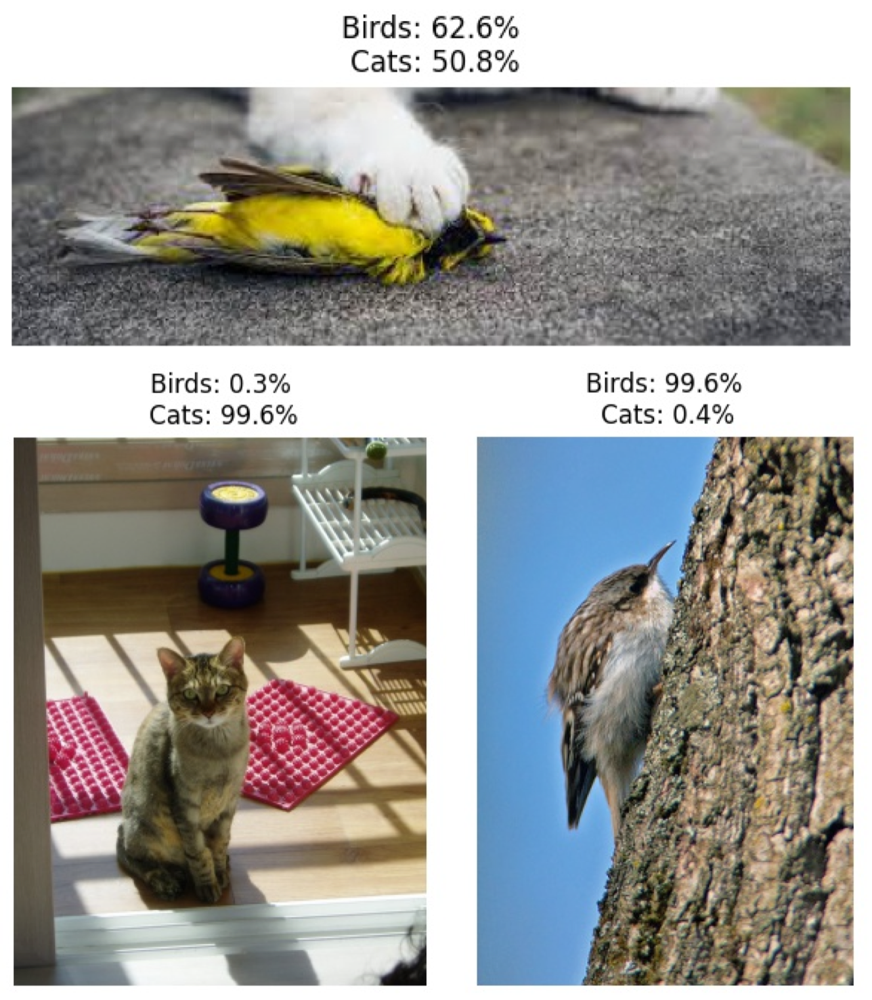
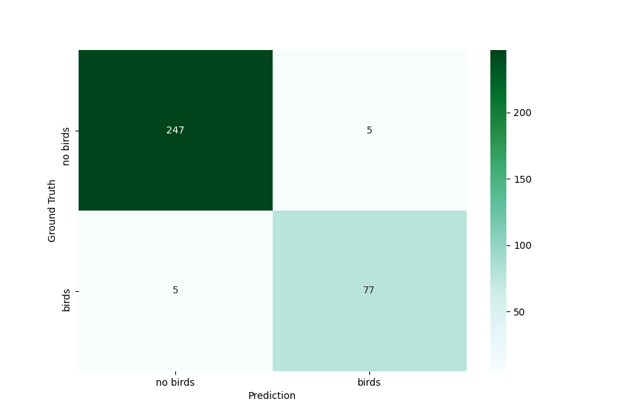
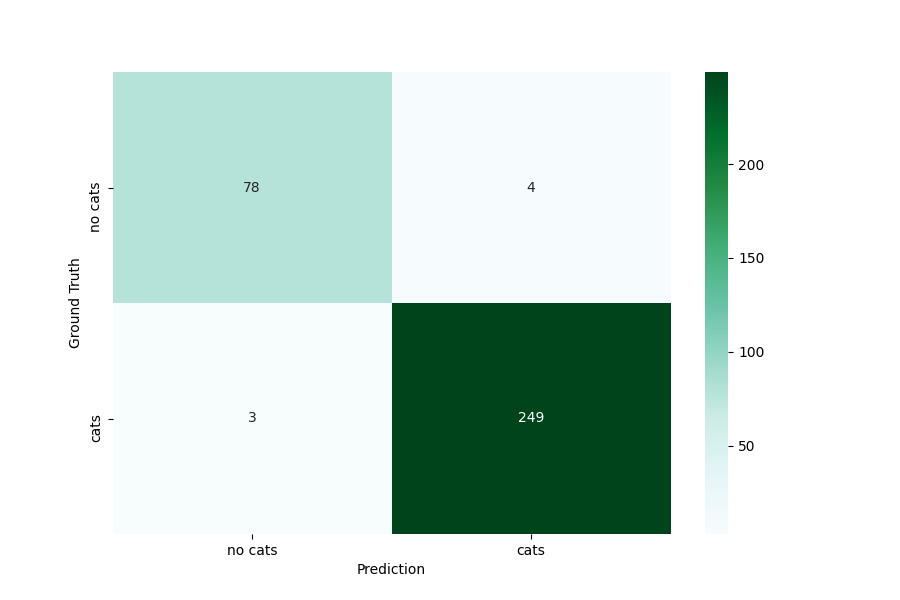

# Exercise Project: Cat and Bird Detection

Automatic cat and bird detection using transfer learning from pre-trained MobileNetV2 based on the implemention [here](https://github.com/anilsathyan7/pytorch-image-classification).

## Data split

Splitting training data into train/val using `dataset/data_split.py`


## Train

```python
python train.py --config_dir configs/configs.yaml
```

## Run inference on an image

```python
python test.py <img_file_dir> <saved_model_dir> <output_dir>
```

Sample run
```python
python test.py test/cat/266.jpeg models/model.pth results/
```

Example output:



## Evaluation
```python
python eval.py <img_folder_dir> <saved_model_dir>
```

Sample run
```python
python eval.py test models/model.pth
```

Per class scores
```
Accuracy of class    birds : 97.01 %
Accuracy of class     cats : 97.90 %
Recall of class    birds : 93.90 %
Recall of class     cats : 98.81 %
Precision of class    birds : 93.90 %
Precision of class     cats : 98.42 %
F1 score of class    birds : 93.90 %
F1 score of class     cats : 98.61 %
```

Confusion matrix of class birds:


Confusion matrix of class cats:
